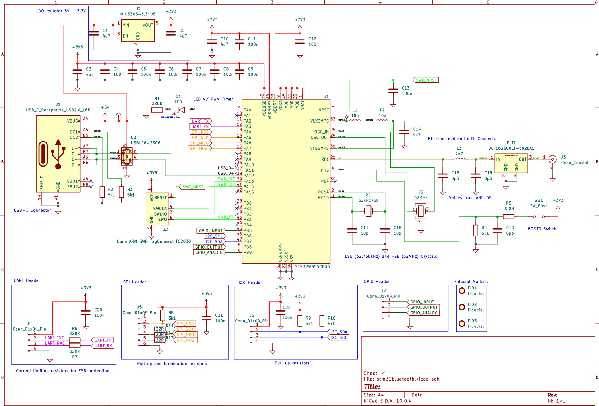
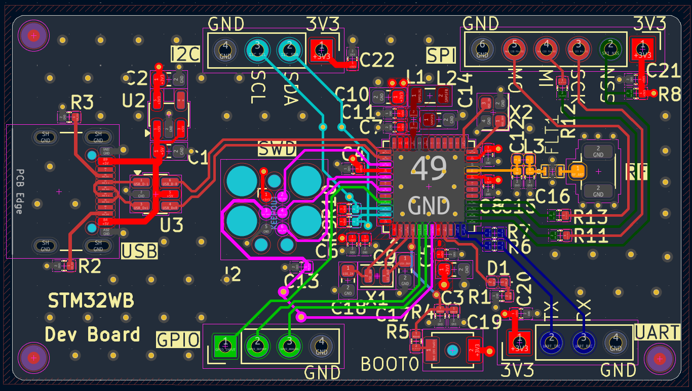

# STM32WB_RF_PCB
Custom 4-layer developement board centered around the STM32WB55CEU6 MCU. The board includes 2.4GHz BLE RF cicuitry, ESD protected USB, SWD, and communication interfaces: UART, I2C, SPI, GPIO.

---

# Components

* **Microcontroller**: STM32WB55CEU6 
* **Power Supply**: USB Type-C stepped down through a 3.3V LDO regulator.
* **Clock:** Dual high-speed external (32 MHz) and low-speed external (32.768 kHz) crystal oscillators.
* **Wireless & RF:** 2.4 GHz RF featuring an impedance-matched filter network and $50\Omega$ trace feeding a U.FL antenna connector.
* **USB & Protection:** USB Type-C interface with a USBLC6-2SC6 ESD protection IC on $90\Omega$ differential data pairs.
* **Peripherals & Interfaces:** General-Purpose I/O (I/O and Analog), I2C, SPI, and UART headers
* **Debug & User Controls:** Tag-Connect SWD programming header, BOOT0 switch, and user status LED.
* **PCB Stackup:** GND planes on layers 1-3, 3V3 plane on layer 4, and contains via stiching to limit interference between planes.

---

**Schematic:**

**PCB:**

